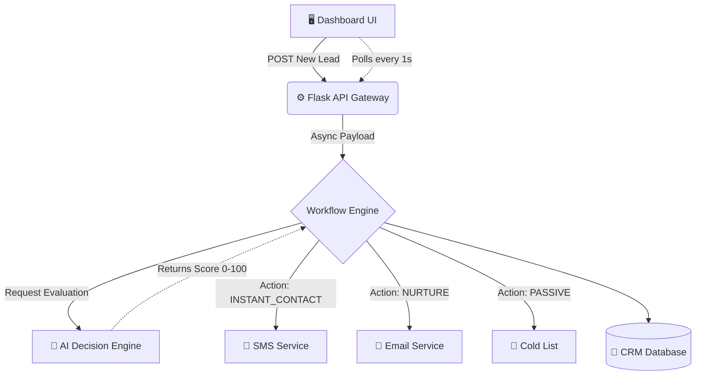
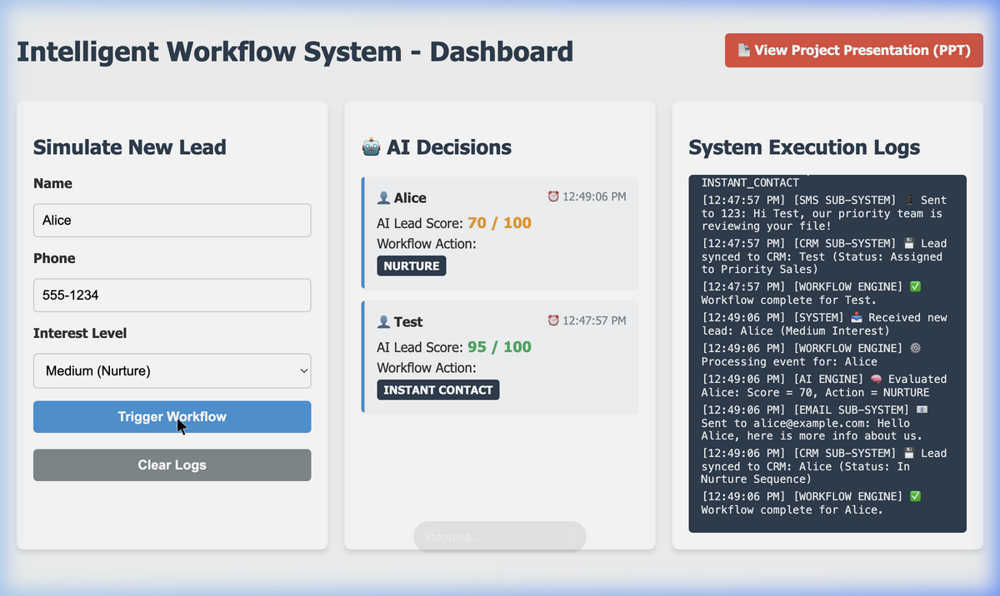

# Intelligent Workflow Automation System

This project is a detailed prototype of an **Intelligent Workflow Automation** platform. It demonstrates how a modern service-oriented architecture can ingest raw data, evaluate it dynamically using an AI scoring engine, and automatically trigger respective downstream integrations (like CRMs or Email services).

## Architecture & Flow

The system operates on a decoupled client-server model:
1. **Frontend UI**: A Single-Page Application (HTML/CSS/JS) capturing lead data and actively polling the backend for real-time logs and AI decision results.
2. **Backend Server (Python/Flask)**: Exposes REST APIs to receive leads and manages asynchronous background threads to process the workflows without blocking the user.
3. **AI Decision Engine**: Calculates a proprietary "Lead Score" out of 100 based on incoming variables (Contact info, Interest Level).
4. **Mock Integrations (API Layer)**: Simulates triggering external SMS, Email, and Database software depending on the AI's ruling.

### System Diagram



## Dashboard Preview



## Getting Started

### Prerequisites
Make sure you have Node or Python (depending on which backend you want to run, this branch focuses on Python).

### Setup & Run
1. Ensure you have Python installed, then set up a virtual environment and install the dependencies:
   ```bash
   python3 -m venv venv
   source venv/bin/activate
   pip install -r requirements.txt
   ```
2. Start the backend Flask server:
   ```bash
   python app.py
   ```
3. Visit the dashboard:
   Open **[http://vercel.com](https://intelligent-wor-git-7a4ecd-betachandrasekhar-gmailcoms-projects.vercel.app)** in your browser.

## Project Structure
- `app.py` - The main Python Flask backend handling the API routes, artificial intelligence scoring logic, and workflow transitions.
- `requirements.txt` - Python project dependencies.
- `server.js` - (Legacy) The original Node.js backend implementation.
- `public/index.html` - The main Dashboard application.

## End-to-End Usage Example
1. You submit a lead named **Alice** with **Medium Interest**.
2. The UI pushes the JSON payload to `/api/leads`.
3. The server immediately returns a `202 Accepted` to keep the UI snappy.
4. In the background, `WorkflowEngine` queries `AIDecisionEngine`.
5. Alice is scored at **70 / 100**. This falls into the `NURTURE` bucket.
6. The engine automatically calls `send_email` and syncs Alice to the CRM.
7. The UI loops and pulls the latest logs via `/api/logs` and dynamically renders the result in the AI panel.
